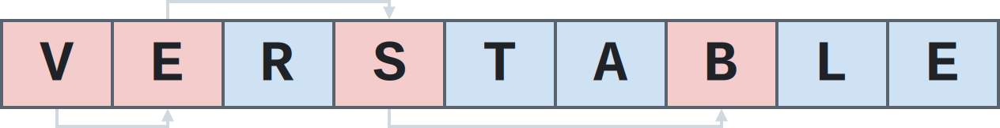

<div align="center">
<picture>
<source media="(prefers-color-scheme: dark)" srcset="images/logo_dark.svg">

</picture>
</div>

## Overview

Verstable is a versatile generic hash table intended to bring the speed and memory efficiency of state-of-the-art C++ hash tables such as [Abseil/Swiss](https://abseil.io/about/design/swisstables), [Boost](https://bannalia.blogspot.com/2022/11/inside-boostunorderedflatmap.html), and [Bytell](https://probablydance.com/2018/05/28/a-new-fast-hash-table-in-response-to-googles-new-fast-hash-table/) to C.

Its features include:

<table>
<tr>
<td valign="top" width="50%">

API:
- Type safety.
- Customizable hash, comparison, and destructor functions.
- Single header.
- C99 compatibility.
- Generic API in C11 and later.

</td>
<td valign="top" width="50%">

Performance:
- High speed mostly impervious to load factor.
- Only two bytes of overhead per bucket.
- Tombstone-free deletion.

</td>
</tr>
</table>

Extensive benchmarks comparing Verstable to a range of other C and C++ hash tables, including [Robin Hood](https://www.sebastiansylvan.com/post/robin-hood-hashing-should-be-your-default-hash-table-implementation/) tables and SIMD-accelerated tables, are available [here](https://jacksonallan.github.io/c_cpp_hash_tables_benchmark/).

Verstable is distributed under the MIT license.

Try it online [here](https://godbolt.org/#z:OYLghAFBqd5QCxAYwPYBMCmBRdBLAF1QCcAaPECAMzwBtMA7AQwFtMQByARg9KtQYEAysib0QXACx8BBAKoBnTAAUAHpwAMvAFYTStJg1AB9U8lJL6yAngGVG6AMKpaAVxYMQANlIOAMngMmABy7gBGmMTeAOykAA6oCoS2DM5uHt7xickCAUGhLBFRXrGWmNYpQgRMxARp7p4%2BZRUCVTUEeSHhkTEW1bX1GU39HYFdhT0lAJQWqK7EyOwcAKQATADMgchuWADUy%2BuOCgT4qAB0CAfYyxoAgje3APSPuwCSDMeGNkw2RrtMuyUBF2BEwLDiBlBZwea3WWBoQV2wVuAFlsLtAgRjECYRt4WNdgBpbAATWMABUSRjBLjNgxtq49gdHAgCAQ4goQM9iEwAO5nYCEBCuMKuJQLWSMAhnNAsR4AKSYyAA1goBLdaAYGI8AGqRT5heiPFhMQKPABu%2BuqhswFyuMLuzzeH2qgjwP0CwH%2BuxNcRBYIhP1ttPxiORaOpWMxxl9IcwCMwRNJFKpmLjCd2OtufhTkdpWx2ieZrPZnO5fIFQpFYsiaEEUplqDlipVaoYGq1uqtTBtxtN2stxAN9Dt62udwemJ9/Ygu3NqDw6F2Uxh0QAQg9drsnUJMNKHbct9Ggbs5sRsXuDhu7lvzVGGIRZ2svGeL8CV%2Btr/cb9uXu9xb8XrKpgACeCjQj%2B/DELOU54Ps6wACK7BoV4YvBji7FwKGfvsqwbnhcErj%2ByzrpuW6Rm%2BxiEMQGIEDRBxIXeVEfJEBBPqsL7zG%2BpBoR%2BX7kRiVCzkxeAKMYDgwXRy7LmRW4kfxAm/rsADyrjAqgVA%2BmCJAgTxar/GEJD7j%2BAlMdsmCGK4cTsZx54nnxsnkcQe7zAwmFXo5JEIWRXkHluTrYDySR/MBYEQYeuxQTBghoQxyGoXBzKYdha6xXhcXrDJJlzlikRMEoNmvkCPGER5E4/k6ABKe7EHgmDmp6uyheBZFRZGsWIfFOGJYcyWoWs%2BFrqVxGkdlx57lRUnUfBjFYsAe6FVxxW8WVEVHkJuxgGAIliRJtE0VMWVreRcS1YIG1rKsawAKxLpdJV0Wc6A/EwAC0VyhTJn4%2BdE3kVS8yhnaC6AgJhuyrLski7NduzRLsAAcflKa8oI8jYAjhVuUWOeNUZTVJcVMTQQ5sbhtlvl9ClbltO3iQw6CSQdq0CdNhNYkEqik9NRERTzAmnZiF2rFdqy3bhqwPcQT0ve9Y6fQ5/27IDmKYCD4OQ7DYMw4j5URWZ9CWdZZNFXulNI06KJMHE4VkdG0a%2BqeXGxt9P4iQ%2BpPPq%2BDsK9%2BEVOv%2BrGNc1/z03OYiuJgLWQSQ0XAj1SEpR1GFYf16UEUdcmjcdduCDGVuTTRrOdW7AGLeevolSVuGpVwZtjRttN7dzGfkfJjn%2BS8qnqZpbAsDpemoAZRmY4p%2BsWQwVll3nfo%2B4puzOQQrnuS7x2%2BSNf2%2Bx3uyBflQegQoIdLua4eRyPbWwTNXWpT1yeJ4l6WdZlfPkUxeUFcbTtW1XPtkVVNV1Q1EK%2B9D5hzcKfVqMd2rxyvknPqOEBoDWGhFNuY1c723ztNIus1jDzQ9hxL2X8VorxZhtGmUZdr00ZtJZ%2B/MgZCXbq3YWN0QbMPFqQBhR5HrPWqLLbAoV2HZRZlwmWVxj60AYbPfYv1f4AyBqrUGXAQAQ1WCATKkgQAw2ut4WGIB4YIxAAATnNn%2BVGHoMYQOgjjNBudfQF32pfImeASZT29szciZCqIUIZvYyRnD6LF3ZpgTmVDn40N2ALc6EAGGXWYSAVh90GHUWljwj6oEBHHT8ckt6oixCOUkU6ZW9Y1YqLURonRejFEQy0V4fRRjda3ixOZQ2LirZ13uNIu4HAZi0E4NdXgnhuC8FQJwDCap5iLFwusHgpACCaC6TMBAFksBRAgDMZUGiDFnC8NdLg10SgGMkJIUWGh4axB6RwSQ/S5mkGGRwXgnINAzLmTMOAsAkBBPKGpEg5BKA1GAAoZQhhMC0CEAgVAvIBnTNlHEOgZiGCAqCCCsFELrnQroD0ZAwAuDC1IGi%2BgxBgisCWLwPFkQu6gvBQMrQvhVDlFuMQf5nBeAfOQFUfAAzeD8EECIMQ7ApAyEEIoFQ6gODUt0FwfQhgTBmH0HgMInJIAzFQHEdGHwmU3MHLVLACrVmkGIK4N0bBySoBcDqmYYyFh8r6OyhFwKKUosGTM5ySxpm8h5HETgPBum9KuaKoZnBsC0uQF8miqh4ZeFel4KGwBkDIEwqsM4EMICOB4rgQgJBJlcCmLwWZfqpgLKWT0XV6zJAaDOOsSQ8NJDrFWBoa611oiSAMVwdY%2BhOCXNIFS/1dyLAgEebmrQ%2Ba20cFWL66ltyc3PJmIOJIdhJBAA%3D).

A variation of Verstable is also available as part of the broader generic data-structure library [Convenient Containers](https://github.com/JacksonAllan/CC).

## Installation

Just [download](verstable.h?raw=1) `verstable.h` and place it in your project's directory or your common header directory.

## Example

<table>
<tr></tr>
<tr>
<td valign="top">
Using the generic macro API (C11 and later):

```c
#include <stdio.h>

// Instantiating a set template.
#define NAME int_set
#define KEY_TY int
#include "verstable.h"

// Instantiating a map template.
#define NAME int_int_map
#define KEY_TY int
#define VAL_TY int
#include "verstable.h"

int main( void )
{
  // Set.

  int_set our_set;
  vt_init( &our_set );

  // Inserting keys.
  for( int i = 0; i < 10; ++i )
  {
    int_set_itr itr = vt_insert( &our_set, i );
    if( vt_is_end( itr ) )
    {
      // Out of memory, so abort.
      vt_cleanup( &our_set );
      return 1;
    }
  }

  // Erasing keys.
  for( int i = 0; i < 10; i += 3 )
    vt_erase( &our_set, i );

  // Retrieving keys.
  for( int i = 0; i < 10; ++i )
  {
    int_set_itr itr = vt_get( &our_set, i );
    if( !vt_is_end( itr ) )
      printf( "%d ", itr.data->key );
  }
  // Printed: 1 2 4 5 7 8

  // Iteration.
  for(
    int_set_itr itr = vt_first( &our_set );
    !vt_is_end( itr );
    itr = vt_next( itr )
  )
    printf( "%d ", itr.data->key );
  // Printed: 2 4 7 1 5 8

  vt_cleanup( &our_set );

  // Map.

  int_int_map our_map;
  vt_init( &our_map );

  // Inserting keys and values.
  for( int i = 0; i < 10; ++i )
  {
    int_int_map_itr itr =
      vt_insert( &our_map, i, i + 1 );
    if( vt_is_end( itr ) )
    {
      // Out of memory, so abort.
      vt_cleanup( &our_map );
      return 1;
    }
  }

  // Erasing keys and values.
  for( int i = 0; i < 10; i += 3 )
    vt_erase( &our_map, i );

  // Retrieving keys and values.
  for( int i = 0; i < 10; ++i )
  {
    int_int_map_itr itr = vt_get( &our_map, i );
    if( !vt_is_end( itr ) )
      printf(
        "%d:%d ",
        itr.data->key,
        itr.data->val
      );
  }
  // Printed: 1:2 2:3 4:5 5:6 7:8 8:9

  // Iteration.
  for(
    int_int_map_itr itr = vt_first( &our_map );
    !vt_is_end( itr );
    itr = vt_next( itr )
  )
    printf(
      "%d:%d ",
      itr.data->key,
      itr.data->val
    );
  // Printed: 2:3 4:5 7:8 1:2 5:6 8:9

  vt_cleanup( &our_map );
}
```

</td>
<td valign="top">
Using the prefixed functions API (C99 and later):

```c
#include <stdio.h>

// Instantiating a set template.
#define NAME int_set
#define KEY_TY int
#define HASH_FN vt_hash_integer
#define CMPR_FN vt_cmpr_integer
#include "verstable.h"

// Instantiating a map template.
#define NAME int_int_map
#define KEY_TY int
#define VAL_TY int
#define HASH_FN vt_hash_integer
#define CMPR_FN vt_cmpr_integer
#include "verstable.h"

int main( void )
{
  // Set.

  int_set our_set;
  int_set_init( &our_set );

  // Inserting keys.
  for( int i = 0; i < 10; ++i )
  {
    int_set_itr itr =
      int_set_insert( &our_set, i );
    if( int_set_is_end( itr ) )
    {
      // Out of memory, so abort.
      int_set_cleanup( &our_set );
      return 1;
    }
  }

  // Erasing keys.
  for( int i = 0; i < 10; i += 3 )
    int_set_erase( &our_set, i );

  // Retrieving keys.
  for( int i = 0; i < 10; ++i )
  {
    int_set_itr itr = int_set_get( &our_set, i );
    if( !int_set_is_end( itr ) )
      printf( "%d ", itr.data->key );
  }
  // Printed: 1 2 4 5 7 8

  // Iteration.
  for(
    int_set_itr itr =
      int_set_first( &our_set );
    !int_set_is_end( itr );
    itr = int_set_next( itr )
  )
    printf( "%d ", itr.data->key );
  // Printed: 2 4 7 1 5 8

  int_set_cleanup( &our_set );

  // Map.

  int_int_map our_map;
  int_int_map_init( &our_map );

  // Inserting keys and values.
  for( int i = 0; i < 10; ++i )
  {
    int_int_map_itr itr =
      int_int_map_insert( &our_map, i, i + 1 );
    if( int_int_map_is_end( itr ) )
    {
      // Out of memory, so abort.
      int_int_map_cleanup( &our_map );
      return 1;
    }
  }

  // Erasing keys and values.
  for( int i = 0; i < 10; i += 3 )
    int_int_map_erase( &our_map, i );

  // Retrieving keys and values.
  for( int i = 0; i < 10; ++i )
  {
    int_int_map_itr itr =
      int_int_map_get( &our_map, i );
    if( !int_int_map_is_end( itr ) )
      printf(
      	"%d:%d ",
      	itr.data->key,
      	itr.data->val
    );
  }
  // Printed: 1:2 2:3 4:5 5:6 7:8 8:9

  // Iteration.
  for(
    int_int_map_itr itr =
      int_int_map_first( &our_map );
    !int_int_map_is_end( itr );
    itr = int_int_map_next( itr )
  )
    printf(
      "%d:%d ",
      itr.data->key,
      itr.data->val
    );
  // Printed: 2:3 4:5 7:8 1:2 5:6 8:9

  int_int_map_cleanup( &our_map );
}
```

</td>
</tr>
</table>

## API

Full API documentation is available [here](api_reference.md).

## FAQ

### How does it work?

Verstable is an open-addressing hash table using quadratic probing and the following additions:

- All keys that hash (i.e. "belong") to the same bucket (their "home bucket") are linked together by an 11-bit integer specifying the quadratic displacement, relative to that bucket, of the next key in the chain.

- If a chain of keys exists for a given bucket, then it always begins at that bucket. To maintain this policy, a 1-bit flag is used to mark whether the key occupying a bucket belongs there. When inserting a new key, if the bucket it belongs to is occupied by a key that does not belong there, then the occupying key is evicted and the new key takes the bucket.

- A 4-bit fragment of each key's hash code is also stored.

- The aforementioned metadata associated with each bucket (the 4-bit hash fragment, the 1-bit flag, and the 11-bit link to the next key in the chain) are stored together in a `uint16_t` array rather than in the bucket alongside the key and (optionally) the value.

One way to conceptualize this scheme is as a chained hash table in which overflowing keys are stored not in separate memory allocations but in otherwise unused buckets. In this regard, it shares similarities with Malte Skarupke’s [Bytell](https://www.youtube.com/watch?v=M2fKMP47slQ) hash table and traditional "coalesced hashing".

Advantages of this scheme include:

- Fast lookups impervious to load factor: If the table contains any key belonging to the lookup key's home bucket, then that bucket contains the first in a traversable chain of all keys belonging to it. Hence, only the home bucket and other buckets containing keys belonging to it are ever probed. Moreover, the stored hash fragments allow skipping most non-matching keys in the chain without accessing the actual buckets array or calling the (potentially expensive) key comparison function.

- Fast insertions: Insertions are faster than they are in other schemes that move keys around (e.g. Robin Hood) because they only move, at most, one existing key.

- Fast, tombstone-free deletions: Deletions, which usually require tombstones in quadratic-probing hash tables, are tombstone-free and only move, at most, one existing key.

- Fast iteration: The separate metadata array allows keys in sparsely populated tables to be found without incurring the frequent cache misses that would result from traversing the buckets array.

The generic macro API available in C11 is based on the extendible-`_Generic` mechanism detailed [here](https://github.com/JacksonAllan/CC/blob/main/articles/Better_C_Generics_Part_1_The_Extendible_Generic.md).

### How is it tested?

Verstable has been tested under GCC, Clang, MinGW, and MSVC. `tests/unit_tests.c` includes unit tests for sets and maps, with an emphasis on corner cases. `tests/tests_against_stl.cpp` includes randomized tests that perform the same operations on Verstable sets and maps, on one hand, and C++'s `std::unordered_set` and `std::unordered_map`, on the other, and then check that they remain in sync. Both test suites use a tracking and randomly failing memory allocator in order to detect memory leaks and test out-of-memory conditions.

### What compiler warning options does it support?

When used correctly, Verstable should not generate any compiler warnings under the following settings:

<table>
<tr>
<th>Compiler</th>
<th>Warning options</th>
</tr>
<tr>
<td>
GCC
</td>
<td>

`-Wall` `-Wpedantic` `-Wextra`
</td>
</tr>
<tr>
<td>
Clang
</td>
<td>

`-Wall` `-Wpedantic` `-Wextra`
</td>
</tr>
<tr>
<td>
MSVC
</td>
<td>

`/W3`
</td>
</tr>
</table>

### Why the name?

The name is a contraction of "versatile table". Verstable handles various conditions that strain other hash table schemes—such as large keys or values that are expensive to move, high load factors, expensive hash or comparison functions, and frequent deletions, iteration, and unsuccessful lookups—without significant performance loss. In other words, it is designed to be a good default choice of hash table for most use cases.
